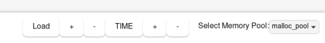
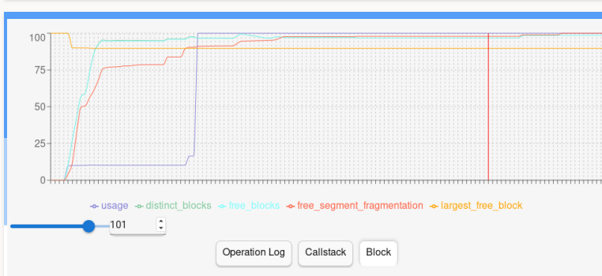
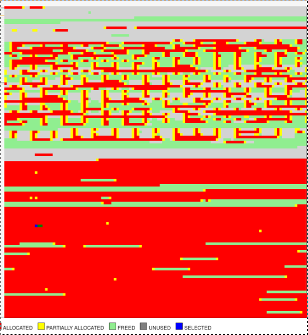
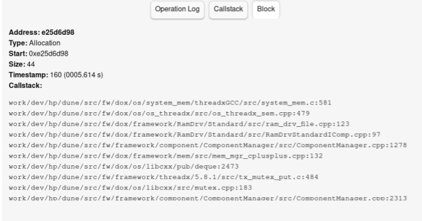
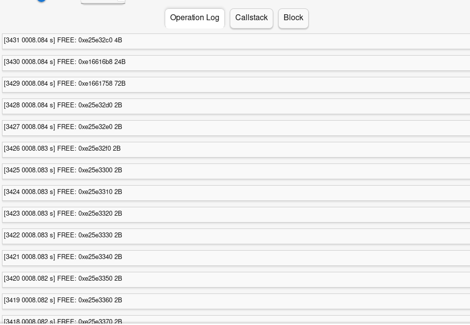

# To build from source:

This tool uses Rust for its backend and TypeScript for its frontend, glued together into an app using Tauri. 

- First, install Node.js. You may do this by first installing nvm from https://github.com/nvm-sh/nvm 


- Then, install the LTS version of node with:

```
nvm install --lts
nvm ls
nvm use 20.11.1
```

You may replace 20.11.1 with the LTS version listed by nvm ls. This tool has been tested with v20.11.1 and should work with most LTS versions of node, but if you face issues, consider installing v20.11.1 specifically.

- Next, install the tauri CLI. Within the root folder of the project (damselfly2) execute:

```
npm install --save-dev @tauri-apps/cli
```

- From the same folder execute:

```
npm run tauri build
```

You may see an error related to bundling an AppImage, but this is normal. 

The compiled executable is located in damselfly2/src-tauri/target/release/

To clean build artifacts, delete the following directories:

```
damselfly2/node_modules/
damselfly2/src-tauri/target/
```

## How to use

Launch the executable and click on Load in the bottom left.

Enter a cache size when prompted, or leave it blank for the default of 1000. This affects performance - a larger cache size consumes less memory, but is slower, and vice versa for a smaller cache size.

A file picker appears next. Select the trace log first and click OK. A file picker will appear again - select the threadxApp binary and click OK.

Enter a value for left padding, followed by right padding. Left padding shifts the addresses of all allocations and frees to the left, while right padding increases the sizes of all allocations and frees. When inspecting blocks and memory operations, the absolute values of addresses and sizes displayed are adjusted to remove padding. However, statistics on the graph are calculated with padding included. The memory map will also show allocations and frees as larger than they actually are due to padding.

Padding lets you ignore fragmentation caused by padding by the memory allocation strategy in use, as this fragmentation cannot be avoided.

Wait for the application to finish parsing the file - you can view its progress in the terminal. 

## Controls



The left set of +/- buttons adjust the size of each block in bytes. Click - to make each block smaller; i.e. fewer bytes. Click + to increase the number of bytes in each block. Shrinking the blocks makes the map more granular and detailed but can affect performance.

The right set of +/- buttons adjust the size of each block, but only visually (enlarging/shrinking each tile). This just makes the map easier to read - it has no effect on the map itself.

The TIME button, when clicked, switches between the realtime x-axis and operation time x-axis. The realtime x-axis is measured in units of 100ms. With the operation time x-axis, each point on the x-axis represents a single memory operation, such as an allocation or a free.

The memory pool dropdown box lets you select a pool to inspect.

## Graph



The graph plots several statistics:

Usage: Bytes allocated.

Distinct blocks: Number of blocks of contiguous memory. For example, two adjacent allocations still count as one block, as they are contiguous.

Free blocks: Number of free blocks. Two adjacent frees still count as one free block as they are contiguous.

Free segment fragmentation: (Total bytes of free space) / (size of largest free block) - 1

This statistic measures fragmentation of the free block. The ideal scenario is all free memory being one free block, which would give a value of 0. The higher the value, the worse the fragmentation.

Largest free block: Size of the largest free block.

As the trace log is not guaranteed to have started when the printer boots, the graph values are not absolute. Instead, 100 on the y-axis represents the maximum value of that statistic observed over the course of the log. A usage of 100% does not imply that memory has been exhausted - only that the memory usage is at its highest at that point. This applies to all statistics.

This also normalises all statistics to be percentage values, allowing them to be plotted on the same graph.

You may click on the graph to select a specific point in time to inspect. The slider and entry box below the graph do the same thing.

## Memory map



The memory map visualises memory in the selected pool at the timestamp selected on the graph.

Red: Allocated.

Yellow: Partially allocated.

Grey: Unused (never allocated nor freed)

Light green: Freed (previously allocated)

Dark blue: Tile clicked on

Dark green: Memory operation overlapping the clicked tile

The map is interactive; you can click on it. Clicking on a tile selects it and highlights it in blue. This also highlights the most recent memory operation that overlaps that tile in dark green. 

In this screenshot, the selected tile is near the bottom left - the selected tile is in dark blue, and the dark green portion represents the most recent operation that included this tile.

The map is sensitive to padding values - it artifically expands memory operations based on the specified padding values.

The map automatically truncates large memory operations for legibility. For example, an allocation of 800,000 bytes occupies the same space in the map as an allocation of 100,000 bytes, as both get truncated to a reasonable value.

By default, all allocations, frees and unused regions can only span 256 tiles on the map (the size in bytes depends on the currently set block size). There is currently no way to change this other than to modify truncateAfter here:
```
          if (realtimeGraph) {
            data = await invoke("get_viewer_map_full_at_colours_realtime_sampled", {
              damselflyInstance: selectedPool,
              timestamp: xClick + realtimeGraphOffset,
              truncateAfter: 256
            });
          } else {
            data = await invoke("get_viewer_map_full_at_colours", {
              damselflyInstance: selectedPool,
              timestamp: xClick,
              truncateAfter: 256
            });
          }
```
in damselfly2/src/App.tsx.

This truncation happens for each operation individually. So, two large allocations adjacent to each other will occupy 256 tiles each, or 512 total. No information is lost - they are just visually smaller to make the map easier to read. 

The correct sizes of each memory operation are visible in the Block details window described below.

## Block details



The Block window describes the block currently selected and highlighted in dark blue. It shows all memory operations that have overlapped this tile from the beginning of the log until the timestamp selected on the graph.

Address is the address of the selected block, whereas Start is the start address of the shown operation.

This screenshot only shows one operation, but this window is scrollable to reveal all past operations on this block. The operations are sorted such that the most recent operation appears first.

## Operation log



The operation log is a way to easily jump to operations and highlight them on the map.

Displays the 128 most recent operations relative to the selected timestamp on the graph. Clicking on one of these entries will select that entry's timestamp on the graph, rewinding the map. It also selects that operation on the map, highlighting it in dark green and the initial tile in dark blue. 

## Callstack

The Callstack tab just shows the callstack of the most recent operation relative to the selected timestamp on the graph.


## Hardcoded values

Truncation length (256), hardcoded in App.tsx. A frontend element could be written to make this configurable.

Realtime graph x-axis (100ms). This is hardcoded into the parsing stage and might be difficult to change.

## Known issues

Changing the block size (in bytes) does not work the first click due to a minor desync bug between the frontend and the backend. It works normally after clicking it again, and henceforth.

Shrinking the block size to a small value and then switching pools might cause a similar desync bug. It is best to switch pools immediately after loading the log before adjusting the block size.

## Developing the tool
The frontend code (TypeScript) is located in damselfly2/src, while the backend code (Rust) is located in damselfly2/src-tauri.

Tauri specific documentation here, useful for tool development: https://tauri.app/v1/guides/getting-started/setup/vite/

To easily view documentation for the Rust code, navigate to damselfly2/src-tauri and execute:
```
cargo doc --open --no-deps
```

This documentation is auto-generated from documentation in the code.